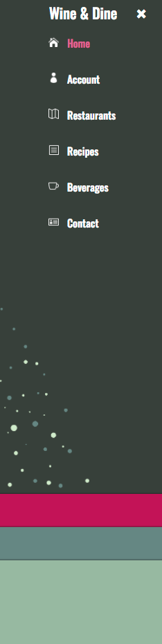
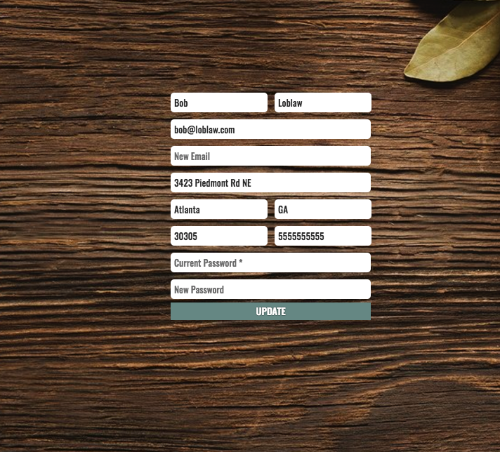

# Wine & Dine
___

## What It Is
	Meal-planning app. Find top restaurants and local favorites by searching your city, area, or neighborhood. Search recipes catered to your preferences, dietary restrictions, and/or available ingredients. Search for fine wines by type, color, variety, and/or price, and recommended recipes to pair with them. 

## Team Members
* [Chris Boeckel](http://github.com/cboe07)
* [Hayes Capers](http://github.com/HayesCapers)
* [Nicolas Blumenstock](http://github.com/nicolasblumenstock)
* [Stephen Ward](http://github.com/stephenward21)

## Languages and Technologies Used
*	HTML
*	CSS
*	JavaScript
*	jQuery
*	Node.js	
*	MySQL
*	Ajax
*	Bcrypt (node module, used to store encrypted passwords into the database)
*	express-session (node module, used to keep the current user logged in and save information about that user.)

## Dependencies and Plugins
*	express
*	express-session
*	pug
*	bcrypt
*	fullpage.js (javascript plug-in)

## APIs used
*	Zomato
*	Yummly
*	Snooth
*	Google Maps

## Site Walkthrough

### Landing Page

	The introductory page for the site. Users can view the logo, a brief overview of the site, and access all of the features of the site from User Accounts, Restaurant, Beverage, and Recipe Searches.

### User’s Account

	Create an Account and access the Accounts page that displays saved favorite recipes and update your account information.

### Restaurant Search

	The Restaurants page will allow users to search for restaurants in their area by a basic location search or view the top-rated restaurants in their area. A random button also exists and allows registered users to have a random restaurant in the area of their stored address. Each return will show the address and cuisine type of the restaurant. 

### Recipe Search

	The recipes page allows users to search for recipes randomly or through a form that offers a series of parameters to narrow search results. Search parameters include: allowing ingredients, excluding ingredients, cuisine, diet, and allergies. Both searches return five results populating five pages generated beneath the original search area. Users have the ability to save recipes that they like. Saved recipes are accessible through the account page.

### Beverage Search

	The beverages page offers users the ability to search for wine suggestions based on color, variety, and price range. Users can also sort search results in ascending or descending order of price. Each search returns twenty wine suggestions with three food pairing suggestions per wine. In addition to searching for wines the user can search for food pairings to go with a wine they already have.
